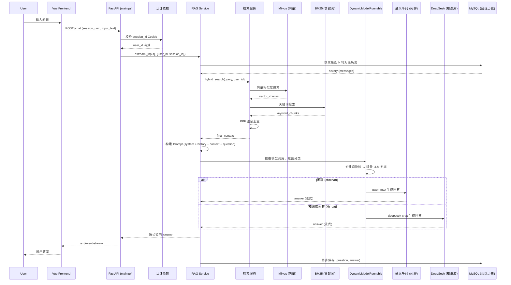
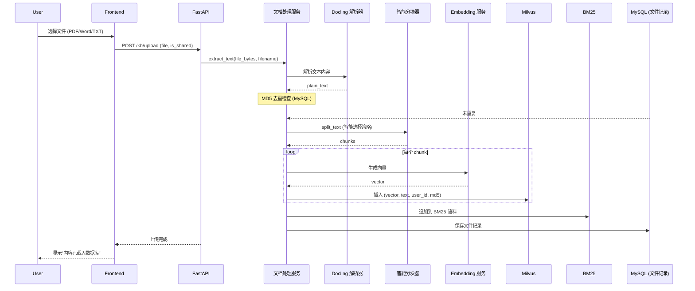
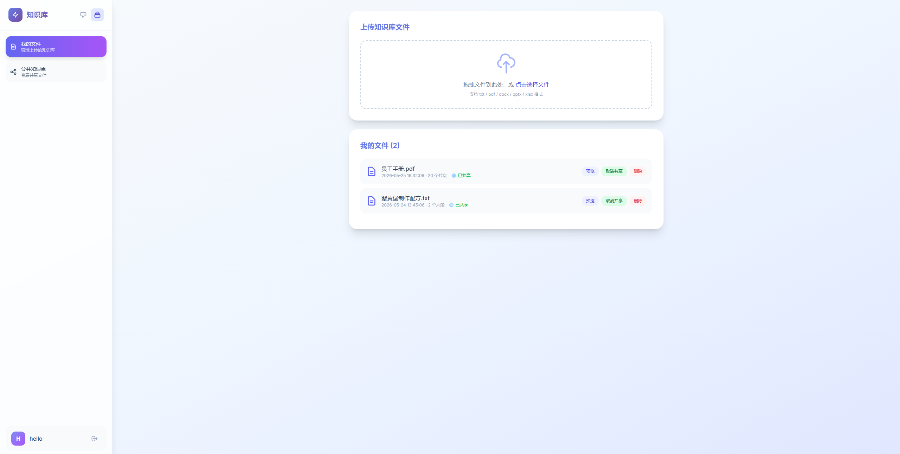
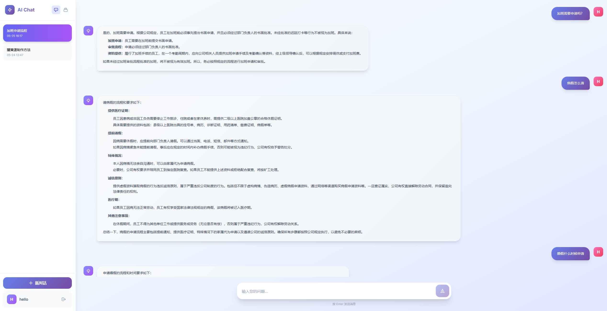

## 项目简介
这是一个基于 LangChain 和 Milvus 的 RAG（检索增强生成）混合检索系统，结合了向量检索和关键词检索的优势，通过语义分割和 RRF 融合策略提高了检索效果。支持用户注册登录、多会话管理、知识库上传/共享/预览、个人知识库隔离。

## 项目结构
```plain
├── app/                      # 主应用目录（分层架构）
│   ├── main.py               # 应用入口（App Factory + 路由注册）
│   ├── api/                  # 路由层（只处理请求/响应）
│   │   ├── deps.py           # 依赖注入（服务实例 + 用户认证）
│   │   └── v1/
│   │       ├── auth.py       # 注册 / 登录 / 状态检查
│   │       ├── chat.py       # 流式聊天接口
│   │       ├── sessions.py   # 会话管理
│   │       └── documents.py  # 知识库文件管理
│   ├── core/                 # 核心配置与工具
│   │   ├── config.py         # Pydantic Settings（支持环境变量）
│   │   ├── security.py       # 密码哈希
│   │   ├── exceptions.py     # 统一异常类 + 全局处理器
│   │   ├── logger.py         # 结构化日志（含 trace_id）
│   │   ├── prompts.py        # 提示词模板（RAG + 意图分类）
│   │   └── text_splitter.py  # 智能文本分块器
│   ├── db/                   # 数据访问层
│   │   ├── milvus_client.py  # Milvus 连接封装（单例）
│   │   └── postgres_client.py# MySQL/PostgreSQL 异步会话管理
│   ├── integrations/         # 外部服务适配器
│   │   ├── embedding.py      # Embedding 模型工厂
│   │   ├── llm.py            # LLM 模型工厂 + ModelRouter 双模型动态路由
│   │   └── bm25.py           # BM25 全文检索引擎
│   ├── services/             # 业务逻辑层
│   │   ├── rag_service.py    # RAG 主流程编排（检索 + 生成）
│   │   ├── retrieval_service.py  # 混合检索（向量 + BM25 + RRF）
│   │   ├── generation_service.py # LLM 调用 + Prompt 构建
│   │   ├── document_service.py   # 文档解析、分块、入库
│   │   ├── session_service.py    # 对话历史管理
│   │   └── memory_service.py     # 短期/长期记忆管理
│   └── models/               # 数据模型
│       ├── models.py         # SQLAlchemy ORM 模型
│       ├── user.py           # Pydantic Schema（用户）
│       ├── chat.py           # Pydantic Schema（对话）
│       └── document.py       # Pydantic Schema（文档）
├── html/                     # 前端页面（Vue 3 SPA）
│   ├── login.html            # 登录/注册
│   ├── chat.html             # 聊天对话
│   ├── kb.html               # 知识库管理
│   └── index.html            # 重定向到 login.html
├── database/                 # 运行时生成的数据文件
│   ├── milvus_db.db
│   ├── bm25_corpus.pkl
│   └── uploads/              # 上传文件的原始内容（用于预览）
├── resource/                 # 运行截图
│   ├── 登录页.png
│   ├── 知识库上传页面.png
│   └── 聊天页面.png
├── .gitignore
├── LICENSE
├── README.md
├── pyproject.toml
└── uv.lock
```

## 核心功能
1. 知识库管理：
    - 支持 .txt / .pdf / .docx / .doc / .pptx / .xlsx 文件上传
    - 使用 Docling 自动提取 PDF、Word、PPT、Excel 等文档的文本内容
    - 语义分割和向量化存储
    - MD5 去重（MySQL 存储）
    - **个人知识库隔离**：每个用户仅检索自己的文件和公共知识库
    - **文件共享**：可分享文件到公共知识库
    - **文件预览**：上传后可在页面上预览文件内容
2. 混合检索：
    - 向量检索（Milvus）
    - 关键词检索（BM25）
    - RRF 倒数秩融合策略
3. 会话管理：
    - 支持多会话
    - 自动生成会话标题
    - 历史消息存储和压缩
4. 用户系统：
    - 注册/登录功能（Cookie 会话）
    - 会话权限管理
    - 知识库文件权限管理
5. **动态模型路由**：
    - 运行时根据问题意图自动选择模型
    - **闲聊**（问候、日常聊天）→ 通义千问 `qwen-max`
    - **知识库问答**（文档查询、资料总结）→ DeepSeek `deepseek-chat`
    - 两级分类策略：关键词快检（零成本）+ 轻量 LLM 兜底
6. 前端界面：
    - Vue 3 + Tailwind CSS，三页面独立 SPA
    - Markdown 渲染回复
    - 知识库文件管理（上传/预览/删除/共享）

## 技术栈
- 后端：FastAPI, SQLAlchemy, Milvus
- 前端：Vue 3, Tailwind CSS
- AI 模型：阿里云 DashScope（通义千问）+ DeepSeek（双模型动态路由）
- 文档解析：Docling（支持 PDF / Word / PPT / Excel 等格式文本提取）
- 向量存储：Milvus（Standalone）
- 检索策略：语义分割 + RRF 倒数秩融合

## 核心调用链路

### 用户提问链路



### 文档上传链路



## 环境要求
- Python >= 3.12
- MySQL 8.0+
- 依赖详见 `pyproject.toml`，额外安装 `docling` 用于 PDF/Word 文档解析
- DashScope API Key（通义千问 + 嵌入向量）
- DeepSeek API Key（知识库问答，可选但建议配置）

## 运行准备

### 1. 环境准备

```bash
# 使用 uv（推荐）
uv sync

# 或使用 pip
pip install -r requirements.txt
```

### 2. 配置环境

方式一（推荐）：创建 `.env` 文件（支持 Pydantic Settings 自动加载）
```env
# ── LLM ──
# 通义千问（用于闲聊 + 嵌入向量）
DASHSCOPE_API_KEY=sk-你的DashScope_API_KEY
# DeepSeek（用于知识库问答）
DEEPSEEK_API_KEY=sk-你的DeepSeek_API_KEY
DEEPSEEK_API_BASE=https://api.deepseek.com

# ── 数据库 ──
DB_HOST=localhost
DB_PORT=3306
DB_USER=root
DB_PASSWORD=你的MySQL密码
DB_NAME=mem_rag
```

方式二：直接编辑 `app/core/config.py`，修改默认值。

### 3. 创建 MySQL 数据库
```sql
CREATE DATABASE mem_rag CHARACTER SET utf8mb4;
```

### 4. 启动 Milvus（如果尚未运行）
```bash
cd ~/projects/milvus-demo
docker-compose up -d
```

### 5. 启动服务
```bash
# 从项目根目录运行
uv run python -m app.main
# 或
cd app && python main.py
```

### 6. 访问前端
打开浏览器，访问 `http://localhost:8000/html/login.html`

## 使用说明
1. 注册/登录：首次使用需要注册账号
2. 创建对话：登录后自动进入聊天页，点击底部"新对话"按钮
3. 上传文件：点击侧边栏顶部 📁 图标进入知识库管理页面上传文件（支持 txt / pdf / docx / pptx）
4. 知识库管理：可查看/删除/共享自己的文件，查看公共知识库
5. 文件预览：在我的文件或公共知识库中点击"预览"查看文件内容
6. 提问：在聊天页输入框中输入问题，按 Enter 发送
7. 查看历史：侧边栏显示所有会话历史
8. 知识库隔离：RAG 检索时仅检索你上传的文件 + 公共文件

## 界面预览

| 登录页面 | 知识库上传页面 | 聊天页面 |
|:---:|:---:|:---:|
|  |  |  |

## 注意事项
1. 确保 `DASHSCOPE_API_KEY` 已正确配置（通义千问闲聊 + 文本嵌入向量都需要）
2. 确保 `DEEPSEEK_API_KEY` 已正确配置（知识库问答使用 DeepSeek 模型）
3. 确保 MySQL 服务已启动且 `mem_rag` 数据库已创建
4. 确保 Milvus 服务已启动（localhost:19530）
5. 首次运行时，系统会自动创建数据库表
6. 上传文件时，系统会自动计算 MD5 去重，重复内容会跳过
7. 所有 Python 命令需从项目根目录运行，使用 `-m` 选项
8. 若端口 8000 被占用，需先终止占用进程再重启服务
9. 日志文件路径：`logs/rag_system.log`，控制台输出 INFO 及以上级别

## 系统 API 接口说明
所有需要身份验证的接口通过 Cookie（`session_id`）进行会话识别。

### 静态资源挂载
- 路径前缀：`/html`
- 说明：项目根目录下的 `html` 文件夹挂载为静态文件目录
- 访问示例：`http://localhost:8000/html/login.html`

---

### 0. 检查登录状态
接口地址：`GET /auth/me`  
认证要求：需携带 `session_id` Cookie

成功响应：
```json
{
  "status": "success",
  "data": {
    "username": "testuser"
  }
}
```
未登录返回 401。

---

### 1. 用户注册
接口地址：`POST /auth/register`  
认证要求：无需认证

请求参数（Query String）：

| 参数名 | 类型 | 必填 | 说明 |
| --- | --- | --- | --- |
| username | string | 是 | 用户登录名 |
| password | string | 是 | 原始密码 |

成功响应：
```json
{
  "status": "success",
  "message": "注册成功"
}
```

错误响应：`400` 用户名已被占用 / `500` 服务器内部错误

说明：密码经加盐 SHA‑256 哈希后存入数据库。

---

### 2. 用户登录
接口地址：`POST /auth/login`  
认证要求：无需认证

请求参数（Query String）：

| 参数名 | 类型 | 必填 | 说明 |
| --- | --- | --- | --- |
| username | string | 是 | 登录用户名 |
| password | string | 是 | 登录密码 |

成功响应：
```json
{
  "status": "success",
  "message": "登录成功",
  "data": { "username": "testuser" }
}
```

Cookie 设置：响应头设置 `session_id` Cookie（`Path=/`, `SameSite=Lax`）。

错误响应：`401` 用户名或密码错误

---

### 3. 创建新对话会话
接口地址：`POST /sessions`  
认证要求：需携带有效 `session_id` Cookie

响应示例：
```json
{
  "status": "success",
  "data": {
    "session_id": "f47ac10b-58cc-4372-a567-0e02b2c3d479",
    "title": "新对话"
  }
}
```

---

### 4. 获取用户的所有会话列表
接口地址：`GET /sessions`  
认证要求：需携带有效 `session_id` Cookie

响应示例：
```json
{
  "status": "success",
  "data": [
    {
      "session_id": "f47ac10b-...",
      "title": "Python 协程使用指南",
      "update_time": "04-14 15:30"
    }
  ]
}
```

说明：按更新时间倒序排列。

---

### 5. 获取指定会话的聊天历史
接口地址：`GET /chat/{session_uuid}`  
认证要求：需携带有效 `session_id` Cookie

| 参数 | 类型 | 说明 |
| --- | --- | --- |
| session_uuid | string | 会话唯一标识 UUID |

响应示例：
```json
{
  "status": "success",
  "data": [
    { "user_input": "什么是 RAG？", "raw_output": "RAG（检索增强生成）..." }
  ]
}
```

---

### 6. 发送消息并获取流式回答
接口地址：`POST /chat`  
认证要求：需携带有效 `session_id` Cookie  
Content-Type：`application/json`

请求体：

| 字段 | 类型 | 必填 | 说明 |
| --- | --- | --- | --- |
| session_uuid | string | 是 | 目标会话 UUID |
| input_text | string | 是 | 用户问题 |

请求示例：
```json
{
  "session_uuid": "f47ac10b-...",
  "input_text": "请解释一下递归函数"
}
```

响应：流式 `text/plain`，返回 `[状态] ...` 提示信息 + 逐字生成回答。

---

### 7. 删除指定会话
接口地址：`DELETE /delete/{session_uuid}`  
认证要求：需携带有效 `session_id` Cookie

响应：
```json
{ "status": "success" }
```

---

### 8. 上传知识库文件
接口地址：`POST /kb/upload`  
认证要求：需携带有效 `session_id` Cookie  
Content-Type：`multipart/form-data`

| 参数 | 类型 | 必填 | 说明 |
| --- | --- | --- | --- |
| file | file | 是 | 文件（支持 .txt / .pdf / .docx / .doc / .pptx / .xlsx） |
| is_shared | string | 否 | "true" 则分享到公共知识库 |

说明：自动计算 MD5 去重，重复内容跳过。非文本格式（PDF/Word 等）通过 Docling 自动提取文本后处理。

---

### 9. 获取我的知识库文件列表
接口地址：`GET /kb/files`  
认证要求：需携带有效 `session_id` Cookie

响应示例：
```json
{
  "status": "success",
  "data": [
    {
      "id": 1,
      "filename": "test.txt",
      "md5": "abc123...",
      "is_shared": false,
      "chunk_count": 15,
      "create_time": "2026-05-24 12:30:00"
    }
  ]
}
```

---

### 10. 删除知识库文件
接口地址：`DELETE /kb/files/{file_id}`  
认证要求：需携带有效 `session_id` Cookie（仅文件所有者可操作）

---

### 11. 切换文件共享状态
接口地址：`POST /kb/files/{file_id}/share`  
认证要求：需携带有效 `session_id` Cookie（仅文件所有者可操作）

响应：
```json
{
  "status": "success",
  "data": { "id": 1, "is_shared": true }
}
```

---

### 12. 预览知识库文件内容
接口地址：`GET /kb/files/{file_id}/preview`  
认证要求：需携带有效 `session_id` Cookie（仅文件所有者或公开文件可预览）

响应：
```json
{
  "status": "success",
  "data": {
    "id": 1,
    "filename": "test.txt",
    "content": "文件内容前 2000 字符...",
    "total_chars": 5000
  }
}
```

---

### 13. 获取公共知识库文件列表
接口地址：`GET /kb/shared`  
认证要求：无需认证

响应：
```json
{
  "status": "success",
  "data": [
    {
      "id": 1,
      "filename": "public.txt",
      "chunk_count": 10,
      "create_time": "2026-05-24 12:30:00",
      "username": "testuser"
    }
  ]
}
```

---

## 补充说明

### 认证机制
- 登录成功后，服务端生成唯一 UUID 作为 `session_id` Cookie（`Path=/`, `SameSite=Lax`）
- 后续请求自动携带该 Cookie，服务端通过比对 `last_cookie` 完成身份验证
- 同一账号可在多个设备独立登录（每次登录刷新 Cookie）

### 数据库表结构
- **User**：用户表，存储用户名、密码哈希、最后一次登录 Cookie
- **ChatSession**：会话表，关联用户，记录会话 UUID、标题
- **ChatMessage**：消息表，关联会话，存储用户输入、完整输出、代码片段、摘要等
- **KnowledgeFile**：知识库文件表，存储文件记录、MD5、共享状态、上传者等

### 知识库隔离机制
- 上传时：文件内容存入 Milvus 时携带 `user_id` 和 `is_shared` 字段
- 检索时：RAG 链路从 Cookie 获取当前用户 ID，Milvus 搜索时按 `user_id == X OR is_shared == 1` 过滤
- 原始文件保存到 `database/uploads/{md5}.txt` 用于预览

### 故障排除
1. Milvus 连接失败：确保 Milvus Standalone 已启动（docker ps）
2. API 服务启动失败：检查端口是否被占用
   ```bash
   netstat -ano | findstr :8000
   ```
3. 文件上传失败：确认文件格式为 txt / pdf / docx / doc / pptx / xlsx 之一，并安装 `docling`（`pip install docling`）
4. 非 txt 文件上传报 `latin-1` 编码错误：安装最新版 dashscope SDK 或在系统环境变量中确保 `LANG` 为纯 ASCII 编码
5. 检索结果不准确：尝试调整 `app/core/config.py` 中的 `DENSE_WEIGHT` / `SPARSE_WEIGHT` 权重参数

## 许可证
MIT License
